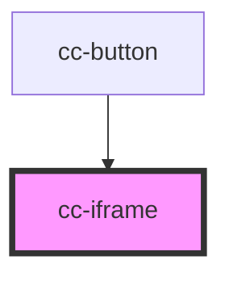

# cc-iframe

<!-- Auto Generated Below -->

## Properties

| Property         | Attribute         | Description | Type      | Default     |
| ---------------- | ----------------- | ----------- | --------- | ----------- |
| `chargeId`       | `charge-id`       |             | `string`  | `undefined` |
| `checkoutId`     | `checkout-id`     |             | `string`  | `undefined` |
| `customMetadata` | `custom-metadata` |             | `string`  | `undefined` |
| `disableCaching` | `disable-caching` |             | `boolean` | `undefined` |

## Events

| Event             | Description | Type                                                                                                                                                                                                                                        |
| ----------------- | ----------- | ------------------------------------------------------------------------------------------------------------------------------------------------------------------------------------------------------------------------------------------- |
| `chargeFailure`   |             | `CustomEvent<{ event: "charge:created" \| "charge:failed" \| "checkout_modal_closed" \| "error_not_found" \| "payment_detected" \| "charge_failed" \| "charge_confirmed" \| "checkout_modal_loaded"; charge: Charge; buttonId?: string; }>` |
| `chargeSuccess`   |             | `CustomEvent<{ event: "charge:created" \| "charge:failed" \| "checkout_modal_closed" \| "error_not_found" \| "payment_detected" \| "charge_failed" \| "charge_confirmed" \| "checkout_modal_loaded"; charge: Charge; buttonId?: string; }>` |
| `errorChange`     |             | `CustomEvent<{ event: "charge:created" \| "charge:failed" \| "checkout_modal_closed" \| "error_not_found" \| "payment_detected" \| "charge_failed" \| "charge_confirmed" \| "checkout_modal_loaded"; charge: Charge; buttonId?: string; }>` |
| `iframeClosed`    |             | `CustomEvent<void>`                                                                                                                                                                                                                         |
| `iframeError`     |             | `CustomEvent<void>`                                                                                                                                                                                                                         |
| `iframeLoaded`    |             | `CustomEvent<void>`                                                                                                                                                                                                                         |
| `paymentDetected` |             | `CustomEvent<{ event: "charge:created" \| "charge:failed" \| "checkout_modal_closed" \| "error_not_found" \| "payment_detected" \| "charge_failed" \| "charge_confirmed" \| "checkout_modal_loaded"; charge: Charge; buttonId?: string; }>` |
| `rendered`        |             | `CustomEvent<void>`                                                                                                                                                                                                                         |

## Shadow Parts

| Part       | Description |
| ---------- | ----------- |
| `"iframe"` |             |
| `"loader"` |             |

## Dependencies

### Used by

 - [cc-button](../cc-button)

### Graph

----------------------------------------------

*Built with [StencilJS](https://stenciljs.com/)*
